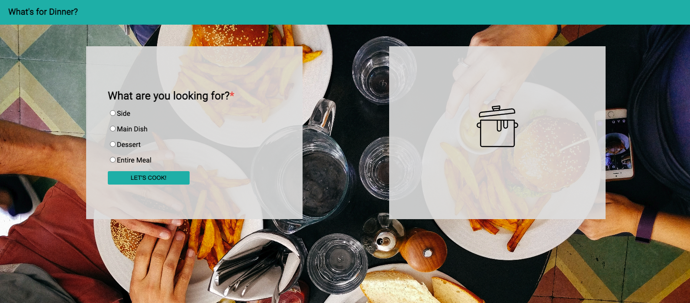
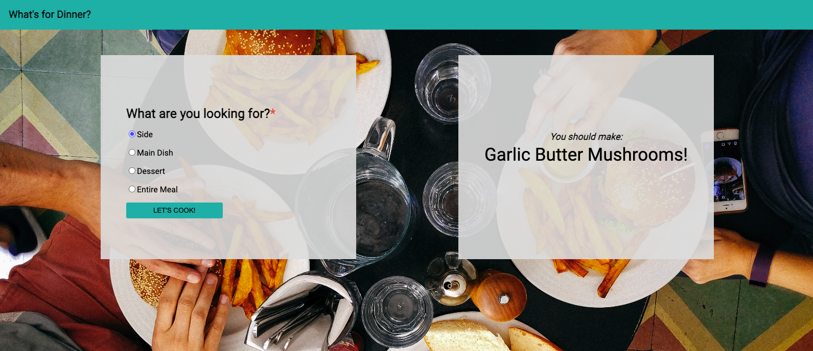

# [What's For Dinner](https://scottdgaines.github.io/whats-for-dinner/)
Mod 1, Challenge 1 (Solo)

## Overview
What's for dinner? That's the ultimate question. This Whats-For-Dinner app can help you decide with the click of a button!

This Whats-for-Dinner app was built by Scott Gaines from a previously-set comp provided by the Turing School of Software and Design. It's architecture includes:
* index.html
* styles.css
* main.js
* an assets folder containing all images used

## Installation Steps

1. Fork and clone this repo to your local machine.
2. Run 'cd ideabox' in your command line to move into the root directory.
3. Run 'open index.html' in your command line to open the application in your browser.

## Using the App

1. Select the type of dish for which you would like a suggestion.
2. Click the "Let's Cook!" button to generate a suggestion.
3. Select the "Entire Meal" option to display a dish suggestion from each category simultaneously.

## Developer Info
Scott Gaines
+ scottdgaines@gmail.com
+ Slack: @Scott Gaines
+ LinkedIn: www.linkedin.com/in/scottdgainesfe
+ GitHub: https://github.com/scottdgaines
